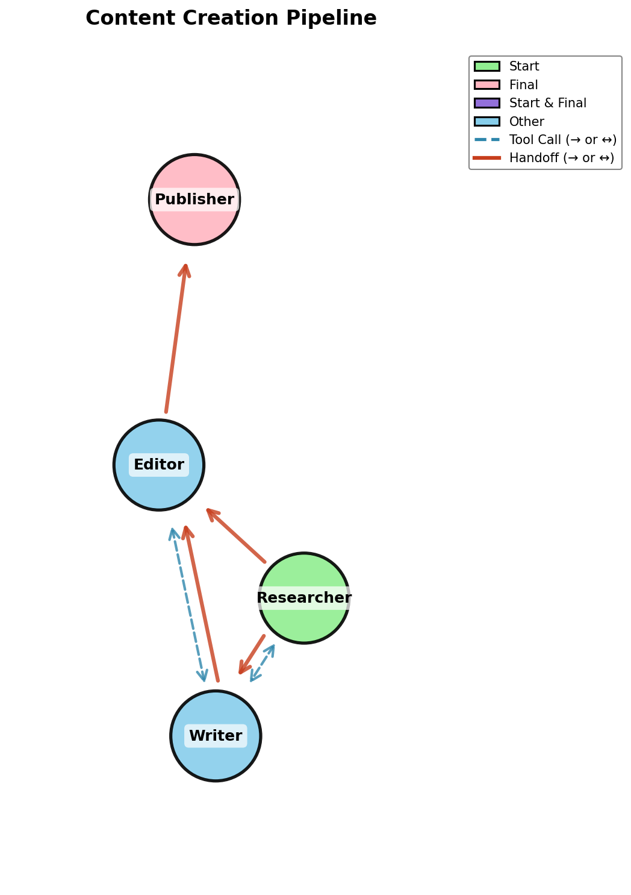

<div align="center">

<h1>pydantic-collab</h1>

**Build AI agent teams that collaborate intelligently — with handoffs, consultations, and shared memory.**


[](https://pypi.org/project/pydantic-collab/)
[](https://github.com/boazkatzir/pydantic-collab/actions)
[](https://github.com/boazkatzir/pydantic-collab/blob/main/LICENSE)
[](https://github.com/astral-sh/ruff)

</div>


## Features

- 🤝 **Tool calls & handoffs** — Agents consult each other or transfer control
- 🕸️ **Pre-built topologies** — Pipeline, Star, Mesh, or fully custom graphs
- 🧠 **Shared agent memory** — Persistent context across agents during a run
- 🗺️ **Topology visualization** — See your agent graph as an image
- 🐍 **Pydantic-AI Native** — Use Pydantic-AI and Logfire observability
- ⚙️ **Configurable context passing** — Control what flows between agents

##  Installation

```bash
pip install pydantic-collab
```

## 🚀 Quick Start

```python
from pydantic_collab import PipelineCollab, CollabAgent

collab = PipelineCollab(
    agents=[
        CollabAgent(name="Researcher", system_prompt="Research the topic thoroughly"),
        CollabAgent(name="Writer", system_prompt="Write a clear, engaging response"),
    ],
    model="openai:gpt-4o-mini",
)

result = collab.run_sync("Explain how neural networks learn")
print(result.output)
```

## When to Use This

Use **pydantic-collab** when you need multiple specialized agents working together, without the need of human 
intervention.

**Relevant Use Cases:**
- Multi-stage workflows (research → analyze → write)
- Specialist teams (coordinator + domain experts)
- Complex tasks requiring different perspectives
- continuous Feedback task (executor <> feedback giver) 

## ⚒️  🤝 Tool Calls vs Handoffs

| | Tool Calls (`agent_calls`) | Handoffs (`agent_handoffs`) |
|---|---|---|
| **Purpose** | Get help, stay in control | Transfer control completely |
| **After call** | Caller continues | Caller stops |
| **Use when** | Help me with X | Take over from here |

## Common Topologies

### Pipeline (Sequential)

```python
from pydantic_collab import PipelineCollab, CollabAgent

collab = PipelineCollab(
    agents=[
        CollabAgent(name="Intake", system_prompt="Summarize the request"),
        CollabAgent(name="Analyst", system_prompt="Analyze in depth"),
        CollabAgent(name="Reporter", system_prompt="Create final response"),
    ],
    model="openai:gpt-4o-mini",
)
```

### Star (Hub & Spoke)

```python
from pydantic_collab import StarCollab, CollabAgent

collab = StarCollab(
    agents=[
        CollabAgent(name="Coordinator", system_prompt="Route to specialists"),
        CollabAgent(name="L1Support", system_prompt="Handle simple issues"),
        CollabAgent(name="L2Support", system_prompt="Handle complex issues"),
    ],
    model="openai:gpt-4o-mini",
)
```

### Mesh (Everyone talks to everyone)

```python
from pydantic_collab import MeshCollab, CollabAgent

collab = MeshCollab(
    agents=[
        CollabAgent(name="Strategist", system_prompt="Business strategy"),
        CollabAgent(name="Technologist", system_prompt="Technical feasibility"),
        CollabAgent(name="Designer", system_prompt="User experience"),
    ],
    model="openai:gpt-4o-mini",
)
```

<details>
<summary><b>Custom Topology</b></summary>

Define explicit tool calls and handoffs:

```python
from pydantic_collab import Collab, CollabAgent

collab = Collab(
    agents=[
        CollabAgent(
            name="Router",
            system_prompt="Route requests",
            agent_calls="Researcher",      # Can call as tool
            agent_handoffs="Writer",       # Can transfer control
        ),
        CollabAgent(name="Researcher", system_prompt="Research topics"),
        CollabAgent(
            name="Writer",
            system_prompt="Write content",
            agent_handoffs="Editor",
        ),
        CollabAgent(name="Editor", system_prompt="Final editing"),
    ],
    model="openai:gpt-4o-mini",
    final_agent="Editor",
)
```

</details>

## 🧠 Agent Memory

Share persistent context between agents during a run:

```python
from pydantic_collab import PipelineCollab, CollabAgent, AgentMemory

arch_memory = AgentMemory(
    name="architecture",
    description="Code architecture decisions and conventions"
)

collab = PipelineCollab(
    agents=[
        CollabAgent(
            name="Architect",
            system_prompt="Document architecture decisions",
            memory={arch_memory: "rw"},  # Can read and write
        ),
        CollabAgent(
            name="Developer",
            system_prompt="Implement following the conventions",
            memory={arch_memory: "r"},   # Read-only
        ),
    ],
    model="openai:gpt-4o-mini",
)
```

<details>
<summary><b>AgentMemory syntax</b></summary>

```python
# Simple string (defaults to 'rw')
CollabAgent(name="Agent", memory="notes")

# List (all default to 'rw')
CollabAgent(name="Agent", memory=["notes", "decisions"])

# Dict for explicit permissions
CollabAgent(name="Agent", memory={"notes": "rw", "config": "r"})
```

</details>

## Visualizing Topology

```python
collab = Collab(...)
collab.visualize_topology()  # Opens image
collab.visualize_topology(save_path="topology.png", show=False)  # Save to file
```

```bash
pip install pydantic-collab[viz]  # Requires visualization dependencies
```



## Adding Tools

```python
collab = Collab(agents=[...], model="openai:gpt-4o-mini")

@collab.tool_plain
async def calculate(expression: str) -> float:
    """Evaluate a math expression."""
    return eval(expression)

@collab.tool_plain(agents=("Researcher",))  # Only for specific agents
async def search(query: str) -> str:
    """Search the web."""
    return f"Results for: {query}"
```

## Result Object

```python
result = collab.run_sync("Query")

result.output              # Final output
result.final_agent         # Agent that produced output
result.execution_path      # ["Intake", "Analyst", "Reporter"]
result.usage               # Token usage statistics

print(result.print_execution_flow())  # Visual flow diagram
```

## Configuration

<details>
<summary><b>Execution Limits</b></summary>

```python
collab = Collab(
    agents=[...],
    max_handoffs=10,           # Maximum handoff iterations (default: 10)
    max_agent_call_depth=3,    # Maximum recursive tool call depth (default: 3)
)
```

</details>

<details>
<summary><b>Handoff Settings</b></summary>

Control what information flows between agents during handoffs:

```python
from pydantic_collab import CollabSettings

collab = Collab(
    agents=[...],
    collab_settings=CollabSettings(
        include_conversation="allow",      # "allow", "disallow", "force"
        include_thinking="disallow",
        include_handoff="allow",
        include_topology_in_prompt=True,
    ),
)
```

</details>

<details>
<summary><b>Custom Prompt Builder</b></summary>

```python
from pydantic_collab import PromptBuilderContext, CollabSettings

def my_prompt_builder(ctx: PromptBuilderContext) -> str:
    lines = [f"Agent: {ctx.agent.name}"]
    if ctx.can_handoff:
        lines.append(f"Hand off to: {', '.join(a.name for a in ctx.handoff_agents)}")
    return "\n".join(lines)

collab = Collab(
    agents=[...],
    collab_settings=CollabSettings(prompt_builder=my_prompt_builder),
)
```

</details>

<details>
<summary><b>Using Dependencies</b></summary>

```python
from pydantic import BaseModel

class MyDeps(BaseModel):
    db: Database
    cache: Cache

collab = Collab(agents=[...])
result = collab.run_sync("...", deps=MyDeps(db=db, cache=cache))
```

</details>

## Examples

See [`examples/`](examples/) for complete working examples:

| Example | Description |
|---------|-------------|
| [`01_simple_chain.py`](examples/01_simple_chain.py) | Basic forward handoff pipeline |
| [`02_bidirectional_chain.py`](examples/02_bidirectional_chain.py) | Agents can handoff back |
| [`04_mesh_network.py`](examples/04_mesh_network.py) | Full mesh collaboration |
| [`08_mesh_with_tools.py`](examples/08_mesh_with_tools.py) | Mesh with function tools |
| [`12_data_analysis_pipeline.py`](examples/12_data_analysis_pipeline.py) | Complex multi-stage workflow |

```bash
uv run --env-file .env examples/01_simple_chain.py
```
